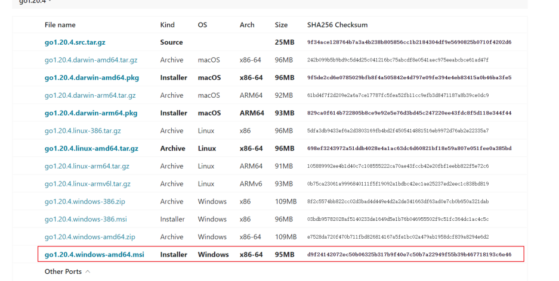

# Go安装

## 在Linux上安装 

我是在CentOS7上面安装的Go，所以下面的环境都是在CentOS7上面的。

### 下载 

首先下载相应的压缩包，地址：https://go.dev/dl/。


然后使用软件`xftp`将压缩包上传到`Linux`的`/usr/local`上

### 解压 

执行以下命令可以将原本的`go`文件夹删除，以及解压下载的压缩包：

```sh
rm -rf /usr/local/go && tar -C /usr/local -xzf go1.20.4.linux-amd64.tar.gz
```

然后就可以删除压缩包了：

```sh
rm -rf go1.20.4.linux-amd64.tar.gz
```

### 配置环境变量 

编辑`/etc/profile`文件

```sh
vim /etc/profile
```

写入环境变量

```sh
export PATH=$PATH:/usr/local/go/bin
```

让变量生效

```sh
source /etc/profile
```

### 测试 

查看版本号，若输出则成功

```sh
go version
```


## 在Windows上安装 

### 下载 

在官网下载对应的文件，可以下载msi或者zip都可，我这里直接下载msi文件。

地址：https://go.dev/dl/



### 安装 

只需要双击应用程序即可安装，默认安装在C盘，可以更改安装路径。

### 添加环境变量 

将`bin`目录添加到环境变量中


### 测试 

打开cmd，输入go version输出版本号即为成功。


# 简单使用

我们只需要写一个`HelloWorld`即可体验GO！

新建一个文本文件，命名为 `HelloWorld.go`

写上如下内容然后保存：

```go
package main

import "fmt"

func main() {
    fmt.Println("Go Hello World!!!")
}
```

唤醒 `cmd`，输入下面命令运行：

```sh
go run HelloWorld.go
```

即可看到输出！

构建成可执行文件：

```sh
go build HelloWorld.go
```

运行上面代码即可生成一个 `exe`文件，即可直接执行。

